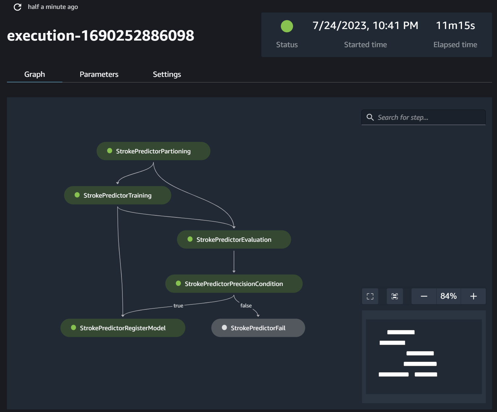
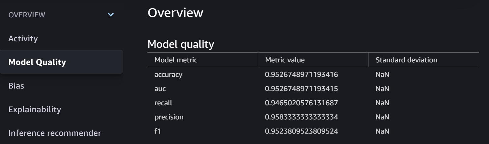

# Stroke Prediction Model Pipeline

## Description
This project focuses on using machine learning to predict stroke instances using a healthcare stroke dataset. The dataset is stored in an Amazon Simple Storage Service (S3) bucket and processed with the help of AWS Data Wrangler. The data is then used to train an XGBoost model via an Amazon SageMaker pipeline. The model is deployed for inference once approved manually, following a certain precision threshold.

## Layout of the StrokePrediction SageMaker Pipeline


```
|-- codebuild-buildspec.yml
|-- CONTRIBUTING.md
|-- pipelines
|   |-- stroke
|   |   |-- evaluate.py
|   |   |-- __init__.py
|   |   |-- pipeline.py
|   |   `-- partition.py
|   |-- get_pipeline_definition.py
|   |-- __init__.py
|   |-- run_pipeline.py
|   |-- _utils.py
|   `-- __version__.py
|-- README.md
|-- sagemaker-pipelines-project.ipynb
|-- setup.cfg
|-- setup.py
|-- tests
|   `-- test_pipelines.py
`-- tox.ini
```

## Components
**Data**: The data used for this project is a healthcare stroke dataset stored in an AWS S3 bucket.

**Data Preprocessing**: AWS Data Wrangler is used to preprocess the data. The steps involve imputing null values, encoding categorical variables, scaling numerical variables, and applying Synthetic Minority Over-sampling Technique (SMOTE) to tackle the issue of unbalanced class data.

**Machine Learning Model:** An XGBoost model is trained on the processed data. The dataset is partitioned according to a given ratio before training.

**Model Evaluation:** Post training, the model is evaluated. If the precision threshold is met, the model is put up for manual approval.

**Model Registration:** Upon manual approval, the model is registered in SageMaker.

**Model Deployment:** A separate pipeline is responsible for deploying the approved and registered model for inference on Amazon SageMaker.

## Pipeline Steps
**Step 1: Data Acquisition and Preprocessing:**
- Retrieve the healthcare stroke dataset from an S3 bucket.
- Use AWS Data Wrangler to preprocess the data: impute nulls, encode categorical variables, scale numerical variables, and apply SMOTE to correct unbalanced class data issues.
- Place the processed data back in an S3 bucket to be used in the AWS SageMaker pipeline.

**Step 2: Model Training:**
- Partition the processed data according to a given ratio.
- Fit the XGBoost model to the data and evaluate its training.

**Step 3: Model Evaluation and Approval:**

- If the model meets a certain precision threshold in evaluation, move the model forward for manual approval.
- If the model is manually approved, register it in AWS SageMaker.

**Step 4: Model Deployment:**

- Once the model is registered, deploy it for inference on SageMaker using a separate pipeline.
- Please ensure that you have necessary AWS permissions and configurations set up in order to execute these steps successfully.

## Dependencies
This project depends on the following AWS services:

**Amazon S3:** For data storage and retrieval.

**AWS Data Wrangler:** For data preprocessing.

**Amazon SageMaker:** For data partitioning, model training, evaluation, registration, and deployment.
Contributions

Feel free to contribute to this project by creating a pull request.

**Questions or Issues**
If you have any questions or run into any issues, please open an issue in this repository.

Thank you for your interest in the Stroke Prediction project!

## Pipeline Diagram



## Metrics


